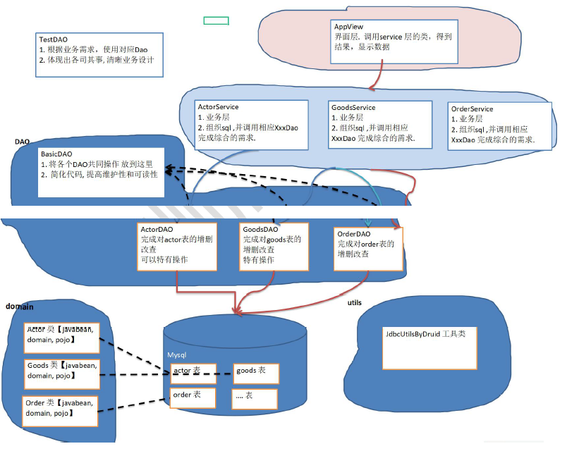

## 1.12 BasicDao

apache-dbutils+ Druid简化了JDBC开发,但还有不足;

- SQL语句是固定，不能通过参数传入，通用性不好,需要进行改进，更方便执行增删改查
- 对于select 操作，如果有返回值,返回类型不能固定，需要使用泛型
- 将来的表很多，业务需求复杂,不可能只靠一个Java类完成

DAO (data access object) :数据访问对象

- 这样的通用类，称为 BasicDao，是专门和数据库交互的，即完成对数据库(表)的crud操作。
- 在BaiscDao的基础上，实现一张表对应一个Dao,更好的完成功能，比如 Customer表-Customer.java类(javabean)
